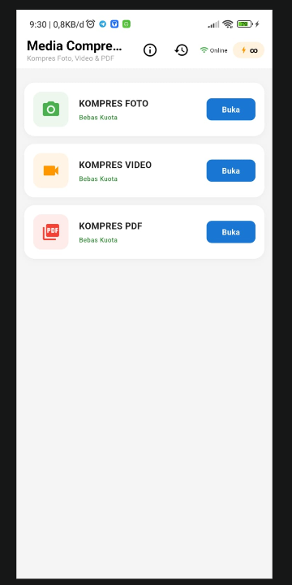
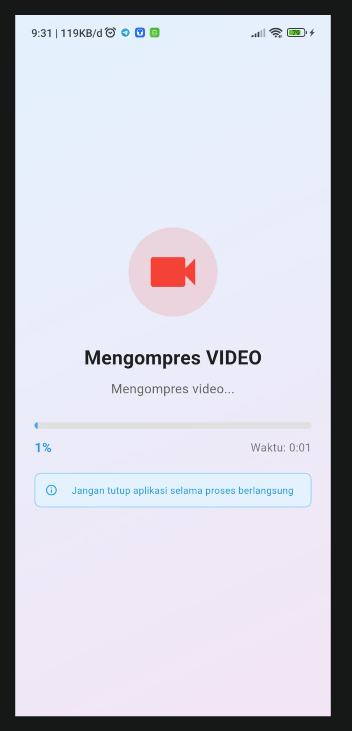
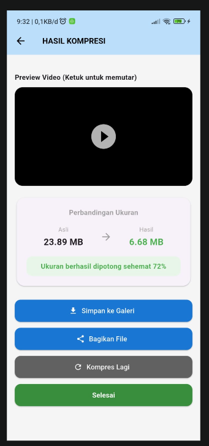
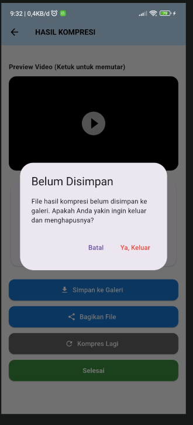

# Media Compressor App

Aplikasi ini saya buat untuk menyelesaikan masalah klasik: ribetnya kirim media (foto/video) yang ukurannya kebesaran, entah itu buat kirim tugas, upload ke sistem kelompok tani, atau sekadar berbagi di medsos. Dengan aplikasi ini, proses kompresi jadi lebih simpel, cepat, dan tetap menjaga kualitas.

### Kenapa Saya Buat Aplikasi Ini?
Jujur, awalnya karena sering banget butuh kompres file tapi males kalau harus buka website atau aplikasi pihak ketiga yang banyak iklannya. Saya pengen solusi yang *native* di HP, simpel, dan nggak ribet.

### Fitur Utama
* **Kompres Foto & Video:** Langsung pilih dari galeri, kompres, selesai. Kualitas tetap terjaga.
* **Integrasi Galeri:** Hasil kompresi langsung masuk ke galeri HP. Nggak perlu cari-cari lagi.
* **Share Langsung:** Setelah dikompres, bisa langsung bagikan ke WhatsApp, Telegram, atau platform lainnya.
* **Bersih:** Ada fitur pembersihan otomatis untuk file sementara (*temporary files*). Jadi memori HP nggak gampang penuh.

### Preview

  
  
  
  

### Teknologi di Balik Layar
Aplikasi ini dikembangkan dengan Flutter. Beberapa *library* yang saya gunakan:
* `flutter_image_compress` & `video_compress`: Mesin utama untuk memproses media.
* `gal`: Biar aplikasi bisa interaksi langsung dengan galeri sistem secara *native*.
* `share_plus`: Biar gampang kalau mau bagi-bagi hasil kompresi.

### Tentang Saya
Halo! Saya Eko Saputra, *fresh graduate* Teknik Informatika dari IIB Darmajaya. Saya fokus di pengembangan aplikasi mobile dan web. Proyek ini saya buat untuk mendalami integrasi *native library* ke Flutter.

Kalau Anda tertarik dengan kodenya, atau mau kasih masukan, silakan buka *issue* atau langsung hubungi saya di LinkedIn. Mari berdiskusi!
